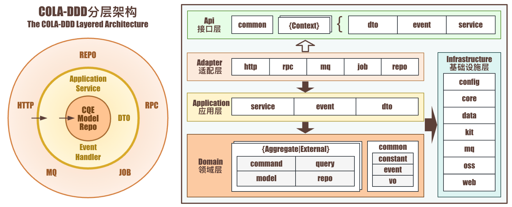

<p align="center">
  <a href="https://github.com/linchuncheng">
    
  </a>
</p>
<h1 align="center"><a href="https://github.com/linchuncheng/ddd4j">DDD4J基础框架</a></h1>
<h4 align="center">基于DDD（领域驱动设计）并支持SaaS平台的单体微服务基础框架</h4>
<p align="center">
  
  
  
  
  <br>
  如果这个项目对你有帮助，请点个 ⭐ Star 支持一下，感谢！
</p>

#### 笔者在开发过程中不断汲取前辈的优秀代码经验，融入自己的代码特色，提炼高复用性代码，并对中间件进行浅封装。旨在快速搭建SaaS业务系统，减少繁琐的CRUD定义，减少不必要的xml代码书写，通过对Model、Query对象的继承，即可实现你想要的CRUD，提高整体代码效率。

> 该框架搭配[COLA-DDD架构](COLA-DDD架构.md)使用效果更佳




### 框架以组件的方式进行划分，包括：

| 组件 | 说明 | 依赖关系 |
|------|------|----------|
| base-bom | 基础依赖组件 | 无 |
| base-core | 基础核心组件 | 无 |
| base-kit | 基础工具箱 | base-core |
| base-data | 基础数据组件 | base-core |
| base-web | 基础WEB组件 | base-core |
| base-mq | 基础MQ组件 | base-core |
| base-excel | EXCEL组件 | base-core |
| base-oss | 对象存储组件 | base-core |
| base-sms | 短信组件 | base-kit |

### 整体设计理念：简洁、灵活、包容

## DDD4j框架结构

```
base
├── base-bom                         // 基础依赖组件
│   └── pom.xml                      // 基准版本依赖管理POM
├── base-core                        // 基础核心组件
│   ├── config                       // 核心配置
│   ├── context                      // 核心上下文
│   ├── contract                     // 核心契约
│   ├── kit                          // 核心工具
├── base-data                        // 基础数据组件
│   ├── annotation                   // 数据注解
│   ├── config                       // 数据配置
│   ├── kit                          // 数据工具
│   └── mybatisplus                  // MyBatis-Plus扩展
│       ├── handler                  // 处理器
│       └── injector                 // 注入器
├── base-excel                       // EXCEL组件
│   ├── annotation                   // Excel注解
│   ├── aop                          // Excel切面
│   ├── converters                   // 类型转换器
│   ├── enhance                      // 增强器
│   ├── exception                    // 异常处理
│   ├── handler                      // 处理器
│   │   ├── listener                 // 监听器
│   │   ├── sheet                    // Sheet处理器
│   │   └── style                    // 样式处理器
│   ├── head                         // 表头处理
│   ├── processor                    // 处理器
│   ├── properties                   // 配置属性
│   ├── utils                        // 工具类
│   ├── validate                     // 校验器
│   └── vo                           // 值对象
├── base-kit                         // 基础工具箱
│   ├── cache                        // 缓存工具
│   ├── enums                        // 枚举工具
│   ├── lang                         // 语言工具
│   └── web                          // WEB工具
├── base-mq                          // 基础MQ组件
│   ├── config                       // MQ配置
│   ├── core                         // MQ核心组件
│   └── impl                         // MQ实现，目前实现了Kafka、Rabbit、Redis发布订阅、RedisStream、Rocket
│       └── event                    // 事件实现
├── base-oss                         // 对象存储组件
│   ├── config                       // OSS配置
│   ├── contract                     // OSS契约
│   │   ├── dto                      // 数据传输对象
│   │   └── enums                    // 枚举定义
│   └── service                      // OSS服务
│       └── impl                     // OSS服务实现
├── base-sms                         // 短信组件
│   ├── config                       // 短信配置
│   ├── contract                     // 短信契约
│   │   ├── constant                 // 短信常量
│   │   └── dto                      // 数据传输对象
│   ├── factory                      // 短信工厂
│   └── service                      // 短信服务
├── base-web                         // 基础WEB组件
│   ├── annotation                   // WEB注解
│   ├── api                          // 基础控制器
│   ├── config                       // WEB配置
│   ├── core                         // WEB核心组件
│   ├── interceptor                  // WEB拦截器
│   └── utils                        // WEB工具类
└── pom.xml
```

## 核心版本

| 框架 | 版本 |
|------|------|
| JDK | 17+ |
| Spring Boot | 3.2.5 |
| Spring Cloud | 2023.0.1 |
| Spring Cloud Alibaba | 2023.0.1.0 |
| MyBatis-Plus | 3.5.5 |
| Hutool | 5.8.26 |

## 使用说明

### 环境准备

Clone代码到本地，添加为Maven工程，修改根目录 `pom.xml` 内的仓库地址为自己的私仓并 Deploy 部署

### 部署脚本

项目提供了 `deploy.sh` 脚本用于快速部署到 Maven 仓库：

| 命令 | 说明 |
|------|------|
| `./deploy.sh -s` | 部署到 snapshot 仓库 |
| `./deploy.sh -r` | 部署到 release 仓库（自动移除 -SNAPSHOT 后缀） |
| `./deploy.sh -h` | 显示帮助信息 |

**配置说明**：部署前需修改 `deploy.sh` 中的仓库配置：

```bash
SNAPSHOT_REPO_ID="snapshots"
SNAPSHOT_REPO_URL="http://your-nexus-server/repository/maven-snapshots/"

RELEASE_REPO_ID="releases"
RELEASE_REPO_URL="http://your-nexus-server/repository/maven-releases/"
```

### 集成方式

顶层pom.xml集成base-bom依赖管理，统一第三方依赖包版本

```xml
……
<dependencyManagement>
    <dependencies>
        <dependency>
            <groupId>com.ddd4j.cloud</groupId>
            <artifactId>base-bom</artifactId>
            <version>3.0.0-SNAPSHOT</version>
            <type>pom</type>
            <scope>import</scope>
        </dependency>
    </dependencies>
</dependencyManagement>
……
```

### 组件依赖

module 的 `pom.xml` 按需引入 base 组件，集成度高的组件无需重复引入

```xml
……
<!--基础核心组件-->
<dependency>
    <groupId>com.ddd4j.cloud</groupId>
    <artifactId>base-core</artifactId>
</dependency>
<!--基础数据组件-->
<dependency>
    <groupId>com.ddd4j.cloud</groupId>
    <artifactId>base-data</artifactId>
</dependency>
<!--基础工具箱-->
<dependency>
    <groupId>com.ddd4j.cloud</groupId>
    <artifactId>base-kit</artifactId>
</dependency>
<!--基础MQ组件-->
<dependency>
    <groupId>com.ddd4j.cloud</groupId>
    <artifactId>base-mq</artifactId>
</dependency>
<!--基础WEB组件-->
<dependency>
    <groupId>com.ddd4j.cloud</groupId>
    <artifactId>base-web</artifactId>
</dependency>
<!--EXCEL组件-->
<dependency>
    <groupId>com.ddd4j.cloud</groupId>
    <artifactId>base-excel</artifactId>
</dependency>
<!--对象存储组件-->
<dependency>
    <groupId>com.ddd4j.cloud</groupId>
    <artifactId>base-oss</artifactId>
</dependency>
<!--短信组件-->
<dependency>
    <groupId>com.ddd4j.cloud</groupId>
    <artifactId>base-sms</artifactId>
</dependency>
……
```

## COLA-DDD架构


本架构以 DDD 为业务建模核心，以整洁架构/六边形架构为分层与依赖指导思想，融合 CQRS/EDA 实现入参级读写分离与领域事件驱动，借助 COLA 提供标准化分层与工程脚手架，打造高可维护、易扩展的企业级应用架构。

### 架构设计思想

| 思想 | 说明 |
|------|------|
| DDD | 以业务领域为中心，通过限界上下文、聚合根、实体、值对象等概念建立领域模型 |
| 整洁架构/六边形架构 | 分离技术实现与业务逻辑，外层依赖内层，领域层不受外部细节污染 |
| CQRS | 查询与命令分离，提升可维护性与性能优化空间 |
| EDA | 领域事件驱动，接口层定义领域事件，领域层定义内部事件，分别由适配层（MQ）和应用层（Event）处理器执行 |
| COLA规范 | 提供分层规范与工程实践，强调模块职责细分、依赖约束、扩展点机制 |

### 分层职责说明

| 分层 | 依赖 | 职责与关键包 |
|------|------|-------------|
| 接口层 | - | 对外暴露服务接口；`common`、`dto`、`event`、`service` |
| 适配层 | 应用层、接口层、领域层 | 接入外部请求，适配内部调用；`http`、`rpc`、`mq`、`job`、`repo` |
| 应用层 | 领域层 | 编排业务用例，控制事务边界；`service`、`event` |
| 领域层 | 无 | 封装核心业务规则；聚合包 `command`、`query`、`model`、`repo`，公共包 `common`（`constant`、`event`、`vo`） |
| 基础设施层 | - | 提供工程配置；`config` |

### 依赖流向

```
调用流向：外部 → Adapter → Application → Domain
实现关系：Adapter 实现 Api.service、Domain.repo
```

- 外层依赖内层，领域层无外部依赖
- 接口层定义 `service` 抽象接口，由适配层实现
- 领域层定义 `repo` 仓库接口，由适配层实现
- 基础设施层提供工程配置，技术组件已封装到 DDD4j 框架

## 工程结构

```
{project}
├── {project}-api                     // 接口模块
│   └── src/main/java/{package}/api
│       ├── common                   // 公共定义，如公共常量、枚举、异常、工具类等
│       └── {context}                // 上下文（如user、order）
│           ├── dto                  // 外部数据传输对象
│           ├── event                // 上下文事件（MQ）
│           └── service              // 服务接口
├── {project}-web                     // 启动模块
│   ├── src/main/java/{package}
│   │   ├── {Project}Application.java // 启动类
│   │   ├── adapter                   // 适配层
│   │   │   ├── http                  // HTTP接口适配
│   │   │   │   ├── admin              // 管理端
│   │   │   │   └── client             // 客户端
│   │   │   ├── job                   // 定时任务适配
│   │   │   ├── mq                    // MQ消费适配
│   │   │   ├── repo                  // 仓库适配
│   │   │   │   ├── dao               // 数据访问对象
│   │   │   │   ├── entity            // 持久化实体
│   │   │   │   └── impl              // 仓库实现
│   │   │   └── rpc                   // RPC适配
│   │   ├── application               // 应用层
│   │   │   ├── event                 // 事件处理器
│   │   │   └── service               // 应用服务
│   │   ├── domain                    // 领域层
│   │   │   ├── {aggregate}           // 聚合
│   │   │   │   ├── command           // 命令
│   │   │   │   ├── model             // 模型
│   │   │   │   ├── query             // 查询
│   │   │   │   └── repo              // 仓库接口
│   │   │   └── common                // 公共域
│   │   │       ├── constant          // 常量
│   │   │       ├── event             // 内部事件
│   │   │       └── vo                // 值对象
│   │   └── infrastructure            // 基础设施层
│   │       └── config                // 工程配置
│   └── src/main/resources
│       ├── application.yml
│       └── mapper                    // MyBatis映射文件
└── pom.xml
```

## 案例演示

### Demo工程结构

```
demo
├── demo-api                           // 接口模块
│   └── src/main/java/com/example/demo/api
│       ├── common                      // 公共定义
│       └── user                        // 用户上下文
│           ├── dto                     // 外部数据传输对象
│           │   ├── UserCreateCmd.java
│           │   └── UserExcelDTO.java
│           ├── event                   // 领域事件
│           │   └── UserSyncMQEvent.java
│           └── service                 // 服务接口
│               └── UserDubboService.java
├── demo-web                           // 启动模块
│   ├── src/main/java/com/example/demo
│   │   ├── DemoApplication.java        // 启动类
│   │   ├── adapter                     // 适配层
│   │   │   ├── http                    // HTTP接口适配
│   │   │   │   ├── admin                // 管理端
│   │   │   │   │   └── UserAdminController.java
│   │   │   │   └── client               // 客户端
│   │   │   │       └── UserClientController.java
│   │   │   ├── mq                      // MQ消费适配
│   │   │   │   └── UserMQListener.java
│   │   │   ├── repo                    // 仓库适配
│   │   │   │   ├── dao                 // 数据访问对象
│   │   │   │   │   └── UserDAO.java
│   │   │   │   ├── entity              // 持久化实体
│   │   │   │   │   └── UserPO.java
│   │   │   │   └── impl                // 仓库实现
│   │   │   │       └── UserRepositoryImpl.java
│   │   │   └── rpc                    // RPC适配
│   │   │       └── UserDubboServiceImpl.java
│   │   ├── application                 // 应用层
│   │   │   ├── event                   // 事件处理器
│   │   │   │   └── UserEventHandler.java
│   │   │   └── service                 // 应用服务
│   │   │       └── UserAppService.java
│   │   ├── domain                      // 领域层
│   │   │   ├── common                  // 公共域
│   │   │   │   ├── event                // 内部事件
│   │   │   │   │   └── UserCreatedEvent.java
│   │   │   │   └── vo                  // 值对象
│   │   │   │       └── UserStateVO.java
│   │   │   └── user                    // 用户域
│   │   │       ├── command             // 命令
│   │   │       │   └── UserCreateCmd.java
│   │   │       ├── model               // 模型
│   │   │       │   └── User.java
│   │   │       ├── query               // 查询
│   │   │       │   └── UserQuery.java
│   │   │       └── repo                // 仓库接口
│   │   │           └── UserRepository.java
│   │   └── infrastructure              // 基础设施层
│   │       └── config                  // 工程配置
│   │           └── RocketMQConfig.java
│   └── src/main/resources
│       ├── application.yml
│       └── mapper                      // MyBatis映射文件
│           └── UserMapper.xml
└── pom.xml
```

### 模块依赖关系

| 模块 | 依赖 | 说明 |
|------|------|------|
| demo-api | 无 | 接口定义，被其他模块依赖 |
| demo-web | demo-api | 启动入口，聚合所有层 |

### 接口层

#### 数据传输对象

```java
package com.example.demo.api.user.dto;

import lombok.Data;

@Data
public class UserCreateCmd {
    private String username;
    private String nickname;
    private String email;
}
```

```java
package com.example.demo.api.user.dto;

import com.ddd4j.cloud.excel.annotation.ExcelLine;
import lombok.Data;

@Data
public class UserExcelDTO {
    @ExcelLine
    private Integer lineNum;
    private String username;
    private String nickname;
    private String email;
}
```

#### RPC服务接口

```java
package com.example.demo.api.user.service;

import com.example.demo.api.user.dto.UserCreateCmd;
import com.example.demo.domain.user.model.User;

public interface UserDubboService {
    
    Long createUser(UserCreateCmd cmd);
    
    User getById(Long id);
    
    void updateStatus(Long id, Integer status);
}
```

#### 领域事件

```java
package com.example.demo.api.user.event;

import com.ddd4j.cloud.core.contract.MQEvent;
import lombok.AllArgsConstructor;
import lombok.Builder;
import lombok.Data;
import lombok.EqualsAndHashCode;
import lombok.NoArgsConstructor;

@Data
@Builder
@NoArgsConstructor
@AllArgsConstructor
@EqualsAndHashCode(callSuper = true)
public class UserSyncMQEvent extends MQEvent {
    private Long userId;
    private String action; // CREATE, UPDATE, DELETE
}
```

### 领域层

#### 模型

```java
package com.example.demo.domain.user.model;

import com.ddd4j.cloud.core.contract.Model;
import lombok.AllArgsConstructor;
import lombok.Builder;
import lombok.Data;
import lombok.EqualsAndHashCode;
import lombok.NoArgsConstructor;

@Data
@Builder
@NoArgsConstructor
@AllArgsConstructor
@EqualsAndHashCode(callSuper = true)
public class User extends Model {
    private Long id;
    private String username;
    private String nickname;
    private String email;
    private Integer status;
    private Long tenantId;
}
```

#### 查询

```java
package com.example.demo.domain.user.query;

import com.ddd4j.cloud.core.contract.Query;
import com.example.demo.domain.user.model.User;
import lombok.AllArgsConstructor;
import lombok.Builder;
import lombok.Data;
import lombok.EqualsAndHashCode;
import lombok.NoArgsConstructor;

import java.time.LocalDateTime;

@Data
@Builder
@NoArgsConstructor
@AllArgsConstructor
@EqualsAndHashCode(callSuper = true)
public class UserQuery extends Query<User> {
    // 精确匹配
    private Long id;
    private String username;
    private Integer status;
    private Long tenantId;
    
    // 模糊查询（后缀Like自动转换为 LIKE '%xxx%'）
    private String nicknameLike;
    
    // 范围查询（后缀In自动转换为 IN (...)）
    private String emailIn;
    
    // 时间范围查询
    private LocalDateTime createTimeStart;
    private LocalDateTime createTimeEnd;
}
```

#### 命令

```java
package com.example.demo.domain.user.command;

import lombok.Data;

@Data
public class UserCreateCmd {
    private String username;
    private String nickname;
    private String email;
}
```

#### 仓库接口

```java
package com.example.demo.domain.user.repo;

import com.ddd4j.cloud.core.contract.BaseRepository;
import com.example.demo.domain.user.model.User;
import com.example.demo.domain.user.query.UserQuery;

public interface UserRepository extends BaseRepository<User, UserQuery> {
}
```

#### 内部事件

```java
package com.example.demo.domain.common.event;

import com.ddd4j.cloud.core.contract.DomainEvent;
import com.example.demo.domain.user.model.User;
import lombok.Getter;

@Getter
public class UserCreatedEvent extends DomainEvent<User> {
    
    public UserCreatedEvent(User user) {
        super(user);
    }
}
```

### 适配层

#### HTTP接口适配

##### 管理端

```java
package com.example.demo.adapter.http.admin;

import com.example.demo.api.user.dto.UserCreateCmd;
import com.example.demo.api.user.dto.UserExcelDTO;
import com.example.demo.application.service.UserAppService;
import com.example.demo.domain.user.model.User;
import com.example.demo.domain.user.query.UserQuery;
import com.ddd4j.cloud.core.contract.Page;
import com.ddd4j.cloud.core.contract.R;
import com.ddd4j.cloud.excel.annotation.ExportExcel;
import com.ddd4j.cloud.excel.annotation.ImportExcel;
import com.ddd4j.cloud.web.api.AggregateController;
import io.swagger.v3.oas.annotations.Operation;
import io.swagger.v3.oas.annotations.tags.Tag;
import lombok.RequiredArgsConstructor;
import org.springframework.web.bind.annotation.*;

import java.util.List;

@Tag(name = "用户管理-管理端")
@RestController
@RequestMapping("/admin/user")
@RequiredArgsConstructor
public class UserAdminController implements AggregateController {
    private final UserAppService userAppService;
    
    @Operation(summary = "创建用户")
    @PostMapping("/create")
    public R<Void> create(@RequestBody UserCreateCmd cmd) {
        userAppService.create(cmd);
        return R.ok();
    }
    
    @Operation(summary = "分页查询")
    @PostMapping("/page")
    public R<Page<User>> page(@RequestBody UserQuery query) {
        return R.ok(userAppService.page(query));
    }
    
    @Operation(summary = "导出Excel")
    @ExportExcel(name = "用户列表")
    @GetMapping("/export")
    public List<UserExcelDTO> export(UserQuery query) {
        return query.list();
    }
    
    @Operation(summary = "导入Excel")
    @PostMapping("/import")
    public R<Void> importExcel(@ImportExcel List<UserExcelDTO> users) {
        userAppService.importUsers(users);
        return R.ok();
    }
    
    // 继承AggregateController后自动拥有以下CRUD接口：
    // GET  /{model}/detail/{id}   - 根据ID查询详情
    // POST /{model}/list          - 列表查询
    // POST /{model}/exist         - 是否存在
    // POST /{model}/count         - 计数
    // POST /{model}/modify        - 修改
    // POST /{model}/save          - 保存（创建或修改）
    // POST /{model}/remove/{ids}  - 批量删除
}
```

##### 客户端

```java
package com.example.demo.adapter.http.client;

import com.example.demo.application.service.UserAppService;
import com.example.demo.domain.user.model.User;
import com.example.demo.domain.user.query.UserQuery;
import com.ddd4j.cloud.core.contract.Page;
import com.ddd4j.cloud.core.contract.R;
import com.ddd4j.cloud.web.api.AggregateController;
import io.swagger.v3.oas.annotations.Operation;
import io.swagger.v3.oas.annotations.tags.Tag;
import lombok.RequiredArgsConstructor;
import org.springframework.web.bind.annotation.*;

@Tag(name = "用户管理-客户端")
@RestController
@RequestMapping("/client/user")
@RequiredArgsConstructor
public class UserClientController implements AggregateController {
    private final UserAppService userAppService;
    
    @Operation(summary = "分页查询")
    @PostMapping("/page")
    public R<Page<User>> page(@RequestBody UserQuery query) {
        return R.ok(userAppService.page(query));
    }
    
    // 继承AggregateController后自动拥有以下CRUD接口：
    // GET  /{model}/detail/{id}   - 根据ID查询详情
    // POST /{model}/list          - 列表查询
}
```

#### 仓库适配

##### 持久化实体

```java
package com.example.demo.adapter.repo.entity;

import com.baomidou.mybatisplus.annotation.*;
import com.ddd4j.cloud.data.annotation.OnCreate;
import com.ddd4j.cloud.data.annotation.OnUpdate;
import com.ddd4j.cloud.data.annotation.TenantId;
import lombok.Data;

import java.time.LocalDateTime;

@Data
@TableName("t_user")
public class UserPO {
    @TableId(type = IdType.ASSIGN_ID)
    private Long id;
    
    private String username;
    
    private String nickname;
    
    private String email;
    
    private Integer status;
    
    @TenantId
    private Long tenantId;
    
    @OnCreate
    @TableField(fill = FieldFill.INSERT)
    private LocalDateTime createTime;
    
    @OnUpdate
    @TableField(fill = FieldFill.INSERT_UPDATE)
    private LocalDateTime updateTime;
    
    @TableLogic
    private Integer deleted;
}
```

##### 数据访问对象

```java
package com.example.demo.adapter.repo.dao;

import com.baomidou.mybatisplus.core.mapper.BaseMapper;
import com.ddd4j.cloud.core.contract.annotation.DAO;
import com.example.demo.adapter.repo.entity.UserPO;
import com.example.demo.domain.user.model.User;
import com.example.demo.domain.user.query.UserQuery;
import org.apache.ibatis.annotations.Mapper;

@Mapper
@DAO(entity = UserPO.class, model = User.class, query = UserQuery.class)
public interface UserDAO extends BaseMapper<UserPO> {
}
```

##### 仓库实现

```java
package com.example.demo.adapter.repo.impl;

import com.example.demo.adapter.repo.dao.UserDAO;
import com.example.demo.adapter.repo.entity.UserPO;
import com.example.demo.domain.user.model.User;
import com.example.demo.domain.user.query.UserQuery;
import com.example.demo.domain.user.repo.UserRepository;
import org.springframework.stereotype.Repository;

@Repository
public class UserRepositoryImpl implements UserRepository {
    
    private final UserDAO userDAO;
    
    public UserRepositoryImpl(UserDAO userDAO) {
        this.userDAO = userDAO;
    }
    
    // BaseRepository 默认实现已提供 CRUD 操作
}
```

#### MQ消息消费适配

```java
package com.example.demo.adapter.mq;

import com.ddd4j.cloud.core.contract.annotation.MQEventListener;
import com.example.demo.api.user.event.UserSyncMQEvent;
import lombok.extern.slf4j.Slf4j;
import org.springframework.stereotype.Component;

@Slf4j
@Component
public class UserMQListener {
    
    @MQEventListener(topic = "USER_SYNC", tags = "CREATE")
    public void onUserSync(UserSyncMQEvent event) {
        log.info("收到用户同步消息: userId={}, action={}", event.getUserId(), event.getAction());
    }
}
```

#### RPC适配

```java
package com.example.demo.adapter.rpc;

import com.example.demo.api.user.dto.UserCreateCmd;
import com.example.demo.api.user.service.UserDubboService;
import com.example.demo.application.service.UserAppService;
import com.example.demo.domain.user.model.User;
import lombok.RequiredArgsConstructor;
import org.apache.dubbo.config.annotation.DubboService;

@DubboService
@RequiredArgsConstructor
public class UserDubboServiceImpl implements UserDubboService {
    
    private final UserAppService userAppService;
    
    @Override
    public Long createUser(UserCreateCmd cmd) {
        return userAppService.create(cmd);
    }
    
    @Override
    public User getById(Long id) {
        return userAppService.getById(id);
    }
    
    @Override
    public void updateStatus(Long id, Integer status) {
        userAppService.updateStatus(id, status);
    }
}
```

### 应用层

#### 应用服务

```java
package com.example.demo.application.service;

import com.example.demo.api.user.dto.UserCreateCmd;
import com.example.demo.api.user.dto.UserExcelDTO;
import com.example.demo.domain.common.event.UserCreatedEvent;
import com.example.demo.api.user.event.UserSyncMQEvent;
import com.example.demo.domain.user.model.User;
import com.example.demo.domain.user.query.UserQuery;
import com.ddd4j.cloud.core.contract.Page;
import lombok.RequiredArgsConstructor;
import org.springframework.stereotype.Service;
import org.springframework.transaction.annotation.Transactional;

import java.util.List;

@Service
@RequiredArgsConstructor
public class UserAppService {
    
    @Transactional
    public Long create(UserCreateCmd cmd) {
        User user = User.builder().username(cmd.getUsername()).nickname(cmd.getNickname()).email(cmd.getEmail()).build();
        // 充血模型：直接调用save方法保存
        user.save();
        // 发布领域事件
        new UserCreatedEvent(user).publish();
        // 发布MQ事件
        UserSyncMQEvent.builder().userId(user.getId()).action("CREATE").build().publish();
        return user.getId();
    }
    
    public User getById(Long id) {
        return UserQuery.builder().id(id).build().one();
    }
    
    public Page<User> page(UserQuery query) {
        return query.page();
    }
    
    public void updateStatus(Long id, Integer status) {
        User.builder().id(id).status(status).build().update();
    }
    
    public void delete(Long id) {
        UserQuery.builder().id(id).build().delete();
    }
    
    @Transactional
    public void importUsers(List<UserExcelDTO> users) {
        users.forEach(vo -> {
            User.builder().username(vo.getUsername()).nickname(vo.getNickname()).email(vo.getEmail()).build().save();
        });
    }
}
```

#### 事件处理器

```java
package com.example.demo.application.event;

import com.example.demo.domain.common.event.UserCreatedEvent;
import lombok.extern.slf4j.Slf4j;
import org.springframework.context.event.EventListener;
import org.springframework.scheduling.annotation.Async;
import org.springframework.stereotype.Component;

@Slf4j
@Component
public class UserEventHandler {
    
    @Async
    @EventListener
    public void onUserCreated(UserCreatedEvent event) {
        log.info("用户创建成功: {}", event.get().getUsername());
        // 发送通知、同步数据等
    }
}
```

### 基础设施层

#### 工程配置

```java
package com.example.demo.infrastructure.config;

import org.springframework.context.annotation.Configuration;

@Configuration
public class RocketMQConfig {
    // RocketMQ相关配置
}
```

### 配置文件

```yaml
# application.yml
spring:
  application:
    name: demo-service
  datasource:
    url: jdbc:mysql://localhost:3306/demo?useUnicode=true&characterEncoding=utf-8
    username: root
    password: root
    driver-class-name: com.mysql.cj.jdbc.Driver

# DDD4J配置
ddd4j:
  mq:
    impl: rocket
    default-topic: DEMO_TOPIC
    namespace: demo
```
